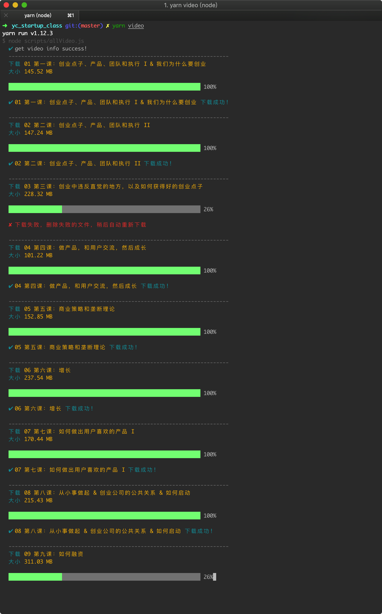

# YC Startup Class

> 📚 辅助学习 YC 的[创业课](http://www.startupclass.club/)

## 使用

先安装依赖

```bash
npm i
# or
yarn install
```

再下载视频

```bash
npm run video
# or
yarn video
```

会将所有视频的名字和对应下载链接信息保存到文件 `.cache/videoInfo.json` 中去

没有差错的话视频就会下载到预留的 `video` 目录了

下载过程如图：



如果中途有下载失败的（如上图第三个视频），会将失败的视频加到队列尾部，稍后会自行重新下载，如图：


## 思维导图

### 01 第一课：创业点子、产品、团队和执行 I & 我们为什么要创业


### 02 第二课：创业点子、产品、团队和执行 II


